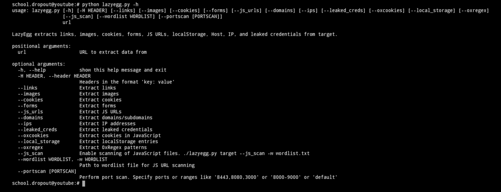
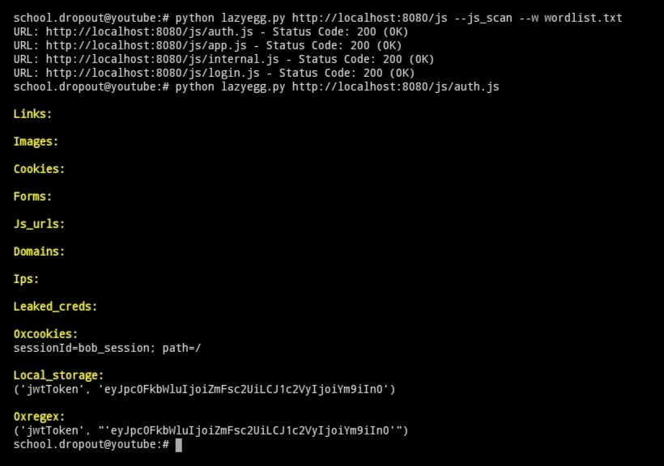
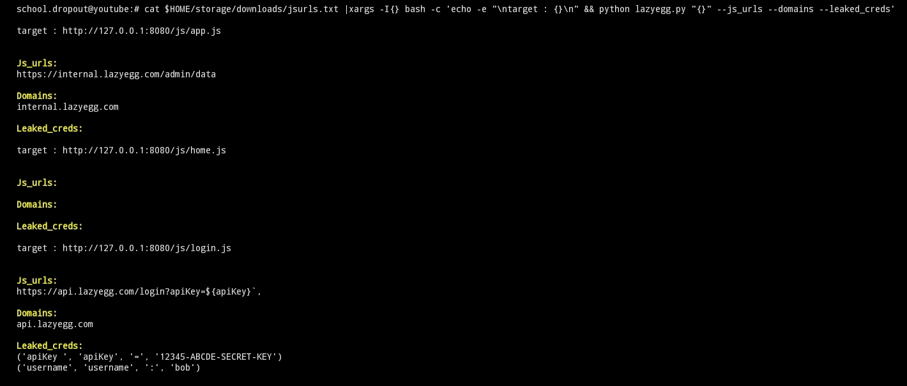

# LazyEgg
LazyEgg is a powerful tool for extracting various types of data from a target URL. It can extract links, images, cookies, forms, JavaScript URLs, localStorage, Host, IP, and leaked credentials. Additionally, it includes a Chrome extension to log real-time JavaScript files as they are loaded.

# Javascript Web Security - EggShop Misconfiguration
https://medium.com/@angryovalegg/javascript-web-security-lazyegg-9bf2c234b6e2

# Features
Extracts links, images, cookies, forms, JS URLs, localStorage, Host, IP, and leaked credentials.
Supports scanning single or multiple JavaScript files.
Includes a Chrome extension for real-time logging of JS files.

# Installation
To install LazyEgg, clone the repository and navigate to the project directory:

```
git clone https://github.com/schooldropout1337/lazyegg.git
```

```
cd lazyegg
```

# Usage
# General Options
To view the available options for LazyEgg, use the -h flag:

```
python lazyegg.py -h
```




# Launch a Scan
To launch a scan on a target URL:

```
python lazyegg.py http://localhost:8080
```


# Find Hidden Files
To find hidden files, such as JavaScript files, using a wordlist:

```
python lazyegg.py http://localhost:8080/js --js_scan --w wordlist.txt
```

# Scan a Single JavaScript File
To scan a single JavaScript file for data:

```
python lazyegg.py http://localhost:8080/js/auth.js
```



# Scan Multiple JavaScript Files
To scan multiple JavaScript files, use a text file containing URLs of the JS files and process them with xargs:

```
cat jsurls.txt | xargs -I{} bash -c 'echo -e "\ntarget : {}\n" && python lazyegg.py "{}" --js_urls --domains --ips --leaked_creds'
```




# Chrome Extension
LazyEgg includes a Chrome extension that logs real-time JavaScript files loaded by the browser. 
It captures the difference in JavaScript files loaded for unauthenticated and authenticated users. When a user logs in, additional JavaScript files specific to the authenticated user are loaded. This allows you to see how the JavaScript environment changes upon authentication, providing insight into the dynamic content and functionality provided to logged-in users.


# To install the extension:

1. Open Chrome and navigate to chrome://extensions/.
2. Enable "Developer mode" using the toggle switch.
3. Click "Load unpacked" and select the chrome_extension directory from the LazyEgg repository.

# Contributing
Contributions are welcome! Please fork the repository and submit a pull request with your changes.

# Alice & Bob's Adventure in EggShop

https://medium.com/@angryovalegg/javascript-web-security-lazyegg-9bf2c234b6e2
